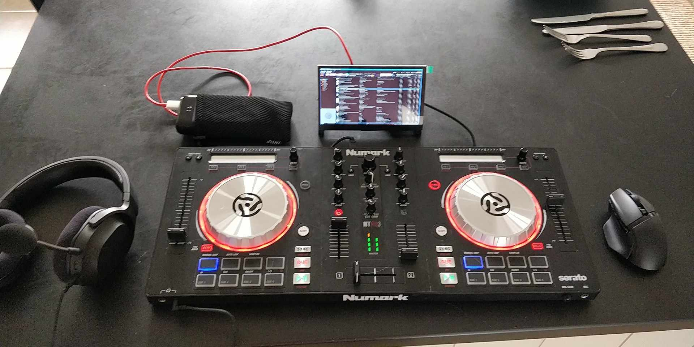
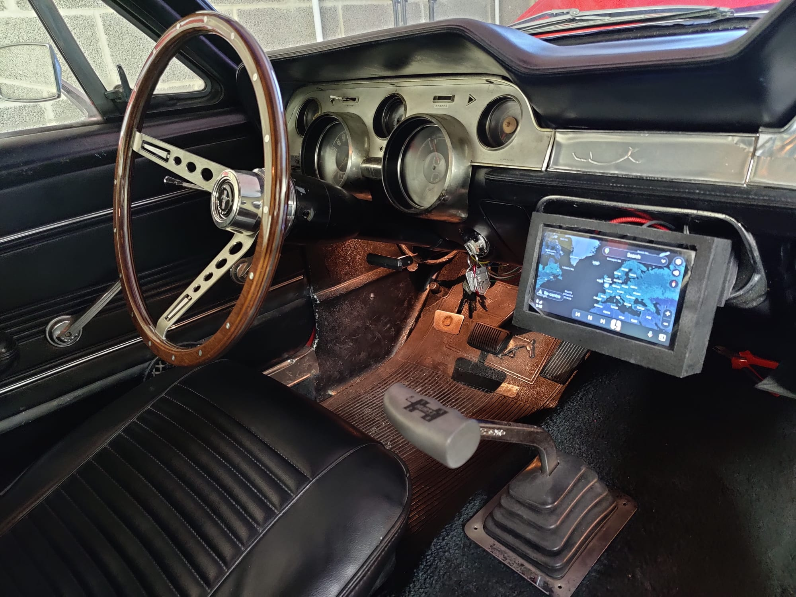
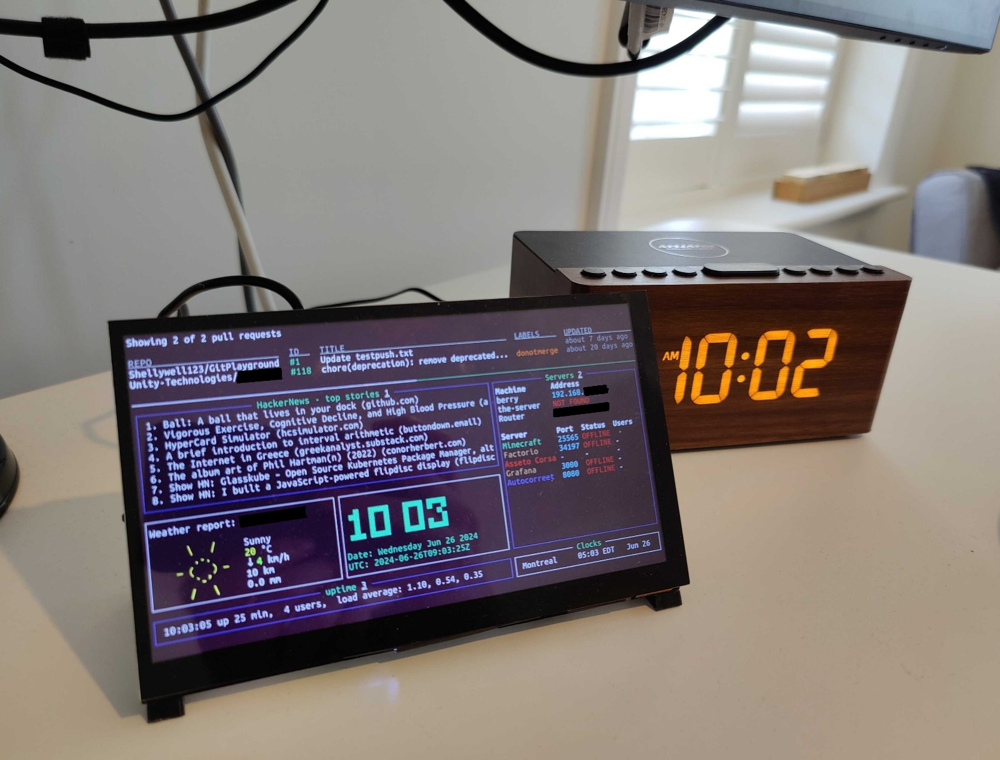

<pre>
you@shellywell123.dev:~/raspberry.pi$ ls
<a href="../index.html">..</a>
</pre>

 
- [mixxx](https://github.com/fayaaz/mixxx-pi-gen)

    

- [CrankshaftOS](https://github.com/opencardev/crankshaft/wiki/Getting-started-with-Crankshaft)

    

- [pi-dash](https://github.com/Shellywell123/pi-dash)

    

